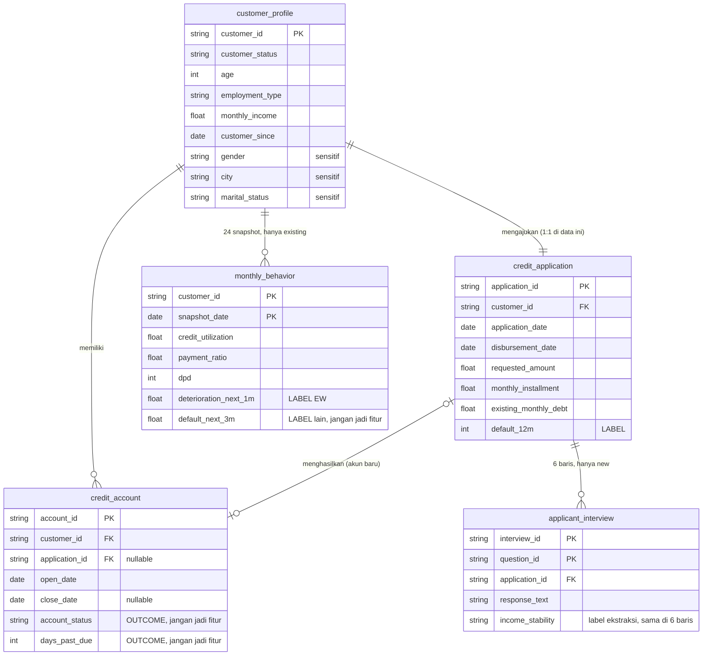

# Penjelasan EDA: ICA (Intelligent Credit Analyst), dari sudut pandang Data Engineer

> Sumber: notebook `ICA_Preprocessing_to_Dashboard.ipynb`, section 1 sampai 5 (load data, kualitas data, pre-processing, EDA, ringkasan insight).
> Dataset: `ICA_Synthetic_v4` (data **sintetis**), run `20261007-142656-eca770`.
> Semua angka di dokumen ini diambil dari output notebook, bukan estimasi.

Dokumen ini membahas EDA bukan sebagai "grafik untuk data scientist". Fokusnya adalah apa yang EDA katakan tentang **bentuk data, grain, relasi, kualitas, dan semantik null**, lalu apa konsekuensinya buat pipeline yang harus dibangun dan dijaga.

---

## Daftar isi

1. [Konteks bisnis singkat](#1-konteks-bisnis-singkat)
2. [Peta data: tabel, grain, dan relasi](#2-peta-data-tabel-grain-dan-relasi)
3. [Input guardrail: kontrak data, PII, lineage](#3-input-guardrail-kontrak-data-pii-lineage)
4. [Kualitas data: missing, integritas, outlier](#4-kualitas-data-missing-integritas-outlier)
5. [Pre-processing: dari tabel mentah ke tabel dasar](#5-pre-processing-dari-tabel-mentah-ke-tabel-dasar)
6. [EDA: temuan per bagian](#6-eda-temuan-per-bagian)
7. [Ringkasan insight](#7-ringkasan-insight)
8. [Catatan kritis untuk Data Engineer](#8-catatan-kritis-untuk-data-engineer)
9. [Implikasi ke desain pipeline](#9-implikasi-ke-desain-pipeline)
10. [Lampiran: contoh SQL](#10-lampiran-contoh-sql)

---

## 1. Konteks bisnis singkat

ICA membangun tiga model. Masing-masing punya **unit (grain) dan label yang berbeda**. Ini hal pertama yang harus dipegang, karena hampir semua bug pipeline di kasus kredit berasal dari salah grain atau salah waktu.

| Model | Grain (1 baris =) | Label | Definisi label |
|---|---|---|---|
| Credit Risk, new applicant | 1 aplikasi | `default_12m` | DPD ≥ 90 dalam 12 bulan setelah pencairan |
| Credit Risk, existing customer | 1 aplikasi | `default_12m` | sama |
| Early Warning (EW) | 1 nasabah × 1 bulan | `deterioration_next_1m` | bucket DPD bulan depan memburuk (0 / 1–29 / 30–59 / 60–89 / 90+) |

Istilah yang sering muncul:
- **DPD** (days past due): jumlah hari keterlambatan bayar.
- **DSR** (debt service ratio): (cicilan baru + cicilan lama) / penghasilan bulanan.
- **LTI** (loan-to-income): plafon / penghasilan setahun.
- **Utilisasi**: outstanding / limit kredit.
- **Payment ratio**: jumlah yang dibayar / jumlah tagihan.

---

## 2. Peta data: tabel, grain, dan relasi

### 2.1 Inventaris tabel

| Tabel | Baris | Kolom | Sel missing | Duplikat | Grain / primary key |
|---|---:|---:|---:|---:|---|
| `customer_profile` | 12.000 | 13 | 0 | 0 | `customer_id` |
| `credit_application` | 12.000 | 14 | 0 | 0 | `application_id` |
| `credit_account` | 21.990 | 13 | 28.420 | 0 | `account_id` |
| `applicant_interview` | 24.000 | 12 | 0 | 0 | (`interview_id`, `question_id`) |
| `monthly_behavior` | 192.000 | 20 | 41.179 | 0 | (`customer_id`, `snapshot_date`) |

Kalau angka barisnya diurai, struktur datanya terlihat jelas:

- **12.000 nasabah = 4.000 new + 8.000 existing**, dan masing-masing punya **tepat 1 aplikasi** (12.000 aplikasi). Jadi `customer → application` di dataset ini efektif 1:1, walaupun secara skema bisa 1:N.
- **24.000 baris interview = 4.000 aplikasi new × 6 pertanyaan** (Q01–Q06). Interview hanya ada untuk new applicant.
- **192.000 baris bulanan = 8.000 nasabah existing × 24 bulan** (snapshot akhir bulan, Jan 2024 sampai Des 2025). Panel-nya **balanced**: semua nasabah punya 24 snapshot.
- **21.990 akun = 12.000 akun hasil aplikasi + 9.990 akun lama** (akun yang sudah ada sebelum periode aplikasi, `application_id` kosong).

### 2.2 Model relasi (ERD)



Poin penting dari sisi DE:

- **Dua populasi, dua jalur data.** New applicant punya data interview tapi tidak punya riwayat bulanan. Existing customer sebaliknya. Ini dicek eksplisit di notebook (`interview hanya untuk new applicant`, `monthly hanya untuk existing`), dan sebaiknya jadi test permanen di pipeline.
- **Ada kolom "masa depan" di tabel yang sama dengan kolom "masa kini".** `credit_account.account_status` / `days_past_due` dan `monthly_behavior.deterioration_next_1m` / `default_next_3m` adalah outcome. Mereka ada di tabel operasional yang sama dengan fitur, jadi rawan bocor (leakage) kalau ada yang asal `SELECT *`.
- **`applicant_interview` di-denormalisasi.** Enam kolom label ekstraksi (`income_trend`, `income_stability`, dst.) nilainya diulang identik di 6 baris per interview. Grain sebenarnya untuk label ini adalah per aplikasi, bukan per pertanyaan.

---

## 3. Input guardrail: kontrak data, PII, lineage

Sebelum EDA, notebook menjalankan "Input Guardrail" yang sifatnya **fail-closed**: kalau cek kritis gagal, pipeline berhenti (`raise GuardrailError`). Setiap cek dicatat ke `audit_log.jsonl` dengan atribut `layer`, `stage`, `check`, `status`, `detail`, `run_id`.

### 3.1 Kontrak data (schema + range + domain)

Untuk setiap tabel didefinisikan:

| Komponen | Contoh |
|---|---|
| `key` (unik) | `customer_id`; (`customer_id`, `snapshot_date`) |
| `num` (rentang numerik) | `age` 18–75, `interest_rate` 0–40, `credit_utilization` 0–1, `payment_ratio` 0–5 |
| `cat` (domain kategori) | `loan_type` ∈ {Personal, Business, Auto, Home Loan}; `default_12m` ∈ {0, 1} |
| `not_null` | `customer_id`, `monthly_income`, `application_date`, `default_12m`, dst. |

Hasil: semua tabel lolos.

Ada dua lapis batas yang perlu dibedakan:
- **Kontrak teknis** (rentang longgar, misalnya `age` 18–75) untuk menangkap data rusak.
- **Aturan bisnis** (rentang ketat, misalnya `age` 21–60, dicek di section 2.2) untuk menangkap data yang secara teknis valid tapi melanggar kebijakan kredit.

Pemisahan ini bagus dan sebaiknya dipertahankan saat dipindah ke tooling seperti dbt tests, Great Expectations, atau pandera: kontrak teknis = `error`, aturan bisnis bisa `warn` atau `error` tergantung kebijakan.

### 3.2 PII

Dua lapis:
1. **Nama kolom** dipindai regex (`name`, `nik`, `ktp`, `phone`, `email`, `alamat`, `rekening`, dst.). Hasil: tidak ada kolom PII langsung.
2. **Teks bebas** jawaban interview dipindai pola NIK (16 digit), nomor HP, email, dan nomor rekening, lalu di-mask (`[NIK]`, `[PHONE]`, `[EMAIL]`, `[ACCOUNT_NO]`). Hasil: **0 temuan dari 24.000 jawaban**. Hasil masking disimpan di kolom baru `response_text_masked`, tidak menimpa aslinya.

Fungsi `mask_pii()` yang sama dipakai lagi nanti sebelum teks dikirim ke LLM. Dari sisi DE, ini sebaiknya jadi satu library bersama, bukan copy-paste di tiap notebook.

### 3.3 Lineage (fingerprint file)

SHA-256 tiap file CSV dicatat ke audit log bersama jumlah barisnya:

| File | SHA-256 (16 char) | Baris |
|---|---|---:|
| `customer_profile.csv` | `3a2a864ef08a3d8d` | 12.000 |
| `credit_application.csv` | `ad1b18c77819043e` | 12.000 |
| `credit_account.csv` | `9cce8603eb2c0fc3` | 21.990 |
| `applicant_interview.csv` | `1751040b6fa3ca4c` | 24.000 |
| `monthly_behavior.csv` | `23f7bb1d683392ce` | 192.000 |

Artinya setiap model yang dilatih bisa ditelusuri balik ke versi data yang persis dipakai.

---

## 4. Kualitas data: missing, integritas, outlier

### 4.1 Missing value: semuanya punya arti

| Tabel | Kolom | Missing | % | Arti |
|---|---|---:|---:|---|
| `credit_account` | `application_id` | 9.990 | 45,4% | Akun lama, bukan hasil aplikasi di dataset ini |
| `credit_account` | `close_date` | 18.430 | 83,8% | Akun belum ditutup (masih aktif) |
| `monthly_behavior` | `deterioration_next_1m` | 13.283 | 6,9% | Bulan terakhir (tidak ada "bulan depan") atau nasabah sudah default |
| `monthly_behavior` | `default_next_3m` | 27.896 | 14,5% | Pola serupa, horizon 3 bulan |

Tidak ada satu pun missing yang merupakan "data hilang". Semuanya **null yang bermakna** (structural null). Notebook membuktikan ini untuk label EW:

```
Label EW kosong karena bulan terakhir : 8.000
Label EW kosong karena sudah default  : 5.982
Label EW kosong karena hal lain       : 0
```

Catatan: 8.000 + 5.982 = 13.982, lebih besar dari 13.283. Selisihnya **699 baris tumpang tindih**: baris di bulan terakhir yang juga sudah default. Angka 699 ini sama persis dengan jumlah nasabah existing yang pernah default, yang berarti status default di data ini **absorbing** (sekali default, tetap default sampai akhir panel). Ini detail kecil, tapi penting kalau nanti breakdown "alasan null" dibuat jadi metrik monitoring: kategori-kategorinya tidak mutually exclusive.

### 4.2 Integritas: 18 cek, semua lolos

| Kelompok | Cek |
|---|---|
| Keunikan key | `customer_id`, `application_id`, `account_id`, (`customer_id`, `snapshot_date`), (`interview_id`, `question_id`) |
| Referential integrity | aplikasi → profil, akun → profil, akun hasil aplikasi → aplikasi |
| Integritas populasi | interview hanya untuk new, monthly hanya untuk existing |
| Aturan bisnis | umur 21–60, penghasilan > 0, plafon & cicilan > 0, utilisasi 0–1, DPD ≥ 0 |
| Konsistensi waktu | `disbursement_date ≥ application_date`, `close_date ≥ open_date` |
| Konsistensi label | `default_12m = 1` ⇔ akun hasil aplikasi berstatus `Default` |

Cek terakhir paling bernilai: label di `credit_application` direkonsiliasi dengan status di `credit_account`. Di produksi, dua sumber ini biasanya datang dari sistem berbeda (LOS vs core banking), jadi rekonsiliasi semacam ini wajib dijadwalkan.

### 4.3 Outlier

| Tabel | Kolom | Min | Median | Max | Skew | % outlier (IQR) |
|---|---|---:|---:|---:|---:|---:|
| profile | `age` | 21 | 37 | 60 | 0,13 | 0,0 |
| profile | `employment_tenure_months` | 3 | 41 | 396 | 1,66 | 4,4 |
| profile | `monthly_income` | 3,5 jt | 10,6 jt | 166,1 jt | 3,80 | 5,9 |
| application | `requested_amount` | 3 jt | 68,2 jt | 3 M | 4,38 | 10,3 |
| application | `tenor_months` | 12 | 36 | 240 | 2,16 | 15,2 |
| application | `interest_rate` | 7,0 | 11,85 | 18,0 | 0,23 | 0,0 |
| application | `monthly_installment` | 98 rb | 2,6 jt | 63,5 jt | 3,78 | 6,3 |
| application | `existing_monthly_debt` | 0 | 1,2 jt | 60,3 jt | 5,53 | 8,0 |
| monthly | `credit_utilization` | 0 | 0,57 | 1,0 | −0,25 | 0,0 |
| monthly | `payment_ratio` | 0 | 0,98 | 3,0 | −0,73 | 13,4 |
| monthly | `dpd` | 0 | 0 | 545 | 6,30 | 16,0 |
| monthly | `overdue_amount` | 0 | 0 | 898 jt | 29,25 | 16,0 |
| monthly | `total_outstanding` | 0 | 42,6 jt | 3,06 M | 5,13 | 9,5 |

Keputusan notebook: **outlier tidak dibuang**, karena penghasilan tinggi atau plafon KPR 3 M adalah nilai valid. Kemiringan ditangani lewat transformasi log dan rasio (DSR, LTI) di tahap feature engineering.

Interpretasi tambahan dari sisi data:
- **`dpd` dan `overdue_amount` adalah distribusi zero-inflated** (median 0). Di distribusi seperti ini Q1 = Q3 = 0, jadi IQR = 0 dan *semua* nilai non-nol otomatis dianggap outlier. Angka 16% itu sebenarnya "persentase baris yang menunggak", bukan outlier. Metode IQR tidak cocok untuk kolom semacam ini.
- **`tenor_months` 15% outlier** karena distribusinya diskrit dan ditentukan produk (KPR 120–240 bulan vs kredit personal 12–48 bulan). Ini multi-modal, bukan noise.
- `payment_ratio` bisa > 1 (sampai 3,0): nasabah membayar lebih dari tagihan (pelunasan sebagian). Valid, tapi perlu didokumentasikan di kontrak (batas atas 5).

---

## 5. Pre-processing: dari tabel mentah ke tabel dasar

### 5.1 Interview: long → wide

`applicant_interview` (24.000 baris) di-pivot jadi `iv_wide` (**4.000 baris × 10 kolom**), satu baris per aplikasi:
- 6 label ekstraksi diambil dengan `first` (karena nilainya sama di semua baris).
- Transkrip lengkap Q01–Q06 digabung jadi satu kolom `transcript` untuk dipakai GenAI nanti.

### 5.2 Tabel dasar per model

| Tabel | Isi | Shape |
|---|---|---|
| `cr_base` | aplikasi ⟕ profil ⟕ label interview (left join) | 12.000 × 31 |
| `ew_base` | snapshot bulanan ⟕ profil statis | 192.000 × 29 |

Dua keputusan desain yang perlu dicatat:
- Baris EW dengan label kosong **tidak dibuang** di `ew_base`, karena masih dibutuhkan untuk menghitung fitur lag/rolling. Filter label dilakukan belakangan. Ini urutan yang benar: kalau baris dibuang lebih dulu, fitur lag untuk bulan sesudahnya akan salah.
- Fitur perilaku untuk Credit Risk existing **belum** di-join di sini. Mereka dibuat nanti dengan aturan point-in-time (`snapshot_date < application_date`).

---

## 6. EDA: temuan per bagian

### 6.1 Distribusi label: imbalanced, sekitar 10%

| Populasi | Lancar (0) | Positif (1) | Rate positif |
|---|---:|---:|---:|
| Credit Risk, new applicant | 3.530 | 470 | **11,8%** |
| Credit Risk, existing | 7.301 | 699 | **8,7%** |
| Early Warning (nasabah-bulan, label tidak null) | 162.083 | 16.634 | **9,3%** |

Konsekuensi yang diambil notebook: metrik utama **recall** (ditemani precision dan PR-AUC), model memakai **class weight**, dan threshold dipilih dari data, bukan 0,5.

Dari sisi DE: base rate ini adalah angka yang harus dimonitor per batch/bulan. Kalau base rate data baru tiba-tiba 2% atau 25%, kemungkinan besar ada masalah di pipeline label, bukan perubahan perilaku nasabah.

### 6.2 Credit Risk: variabel numerik (default rate per desil)

Setiap variabel dibagi jadi 10 desil (D1 = nilai terendah), lalu dihitung default rate per desil. Rata-rata portofolio = 9,7%.

**DSR: sinyal terkuat dan monoton.**

| Desil DSR | Rentang | Default rate | n |
|---|---|---:|---:|
| D1 | 0,066–0,254 | 1,8% | 1.200 |
| D2 | 0,254–0,318 | 3,3% | 1.200 |
| D3 | 0,318–0,358 | 4,5% | 1.200 |
| D4 | 0,358–0,399 | 4,0% | 1.200 |
| D5 | 0,399–0,441 | 5,7% | 1.200 |
| D6 | 0,441–0,484 | 7,9% | 1.200 |
| D7 | 0,484–0,531 | 10,4% | 1.200 |
| D8 | 0,531–0,585 | 11,9% | 1.200 |
| D9 | 0,585–0,653 | 16,1% | 1.200 |
| D10 | 0,653–1,671 | **31,8%** | 1.200 |

Dari D1 ke D10 risikonya naik sekitar 18 kali lipat. Lompatan terbesar ada di D10 (DSR > 0,65), yang secara bisnis cocok dengan batas DSR yang umum dipakai bank.

**Variabel lain:**

| Variabel | Pola | Bentuk |
|---|---|---|
| Penghasilan bulanan | D1 ~20,5% turun bertahap ke D10 ~4,5% | Monoton turun |
| Masa kerja | D1 ~16,6%, lalu D2–D10 relatif datar 7–11% | Efek ambang (masa kerja sangat pendek) |
| Umur | D1 ~15,4% (paling muda), lalu datar 8–10% | Efek ambang |
| LTI | D1 ~15,8%, lalu 7–11% tanpa pola jelas | **Tidak monoton** |
| Plafon | D1 ~19,7%, D4 ~15%, sisanya 7–9% | **Tidak monoton** |

Interpretasi:
- DSR dan penghasilan cocok untuk model linear (Logistic Regression).
- Masa kerja dan umur lebih tepat dibuat sebagai **flag** (notebook kemudian membuat `short_tenure` = masa kerja < 12 bulan, `young_borrower` = umur < 25).
- LTI dan plafon tidak monoton. Plafon kecil berisiko tinggi kemungkinan besar karena berkorelasi dengan nasabah segmen Mass berpenghasilan rendah. Pola seperti ini lebih mudah ditangkap model berbasis tree atau lewat binning.

### 6.3 Credit Risk: variabel kategorikal

| Variabel | Kategori (default rate, n) | Kekuatan sinyal |
|---|---|---|
| `employment_type` | Contract 24,9% (1.173) · Self-employed 12,6% (2.000) · Salaried 7,4% (6.744) · Business Owner 6,2% (2.083) | **Kuat** |
| `customer_segment` | Mass 14,2% (4.646) · Upper Mass 7,4% (6.343) · Affluent 3,9% (1.011) | **Kuat** |
| `loan_type` | Auto 12,1% · Home 10,0% · Business 9,8% · Personal 8,5% | Sedang |
| `loan_purpose` | Vehicle Purchase 12,1% … Education 7,3% | Sedang |
| `application_channel` | Online 10,4% · Branch 9,6% · Referral 8,4% | Lemah |
| `income_source` | Salary 9,8% · Business 9,6% · Mixed 9,6% | **Hampir tidak ada** |
| `gender` (sensitif) | Female 10,0% · Male 9,5% | Datar |
| `city` (sensitif) | 9,1% (Surabaya) – 10,9% (Bandung) | Datar |
| `marital_status` (sensitif) | Single 9,9% · Married 9,8% · Divorced 8,4% (n=670) | Datar |

Catatan:
- Atribut sensitif (gender, kota, status nikah) **datar** di sekitar rata-rata dan **dikeluarkan dari semua set fitur** sebagai kebijakan fairness. Kolomnya tetap disimpan karena dibutuhkan untuk cek disparitas di Output Guardrail (four-fifths rule). Jadi dari sisi DE, kolom ini tidak boleh ikut ke feature table, tapi harus tetap tersedia di tabel evaluasi/monitoring.
- `loan_purpose = Vehicle Purchase` punya n = 2.515, **sama persis** dengan `loan_type = Auto Loan` (n = 2.515). Artinya ada hierarki/redundansi: Auto Loan selalu Vehicle Purchase. Memakai keduanya sebagai fitur hanya menambah kolinearitas.

### 6.4 Credit Risk new applicant: label interview vs default

Rata-rata new applicant = 11,8%.

| Label interview | Kategori → default rate (n) |
|---|---|
| `income_trend` | increasing 3% (775) · stable 10% (2.197) · declining 24% (628) · volatile 20% (400) |
| `income_stability` | high 5% (2.000) · medium 14% (1.600) · low **36%** (400) |
| `existing_debt_level` | none 8% (944) · low 7% (1.189) · medium 11% (1.145) · high 25% (722) |
| `repayment_issue` | none 7% (2.400) · occasional 15% (1.200) · frequent **30%** (400) |
| `financial_change` | stable 6% (2.000) · expense_increase 17% · income_decrease 17% · business_decline 17% |
| `business_condition` | growing 5% (590) · stable 10% (674) · declining 22% (422) · not_applicable 12% (2.314) |

Semua label punya arah risiko yang masuk akal. `income_stability` dan `repayment_issue` adalah pemisah terkuat (rasio sekitar 7× dan 4× antara kategori terburuk dan terbaik).

Implikasi untuk pipeline:
- Label ini **di produksi akan diisi oleh GenAI** dari jawaban bebas pemohon. Jadi kualitas fitur terkuat untuk new applicant bergantung pada output LLM. Distribusi kategori output GenAI harus dimonitor terhadap distribusi di data training ini.
- `financial_change`: tiga kategori negatif punya rate yang hampir sama (~17%). Secara praktis variabel ini biner (stable vs tidak).
- `business_condition = not_applicable` (n = 2.314) adalah nasabah bergaji. Ini null yang dikodekan sebagai kategori, dan harus konsisten dengan `employment_type`.
- Jumlah per kategori sangat bulat (2.000, 1.600, 400, 2.400, 1.200). Ini jejak generator data sintetis. Distribusi di data nyata hampir pasti berbeda.

### 6.5 Korelasi antar variabel numerik (Spearman)

Pasangan dengan korelasi tinggi (|ρ| ≥ 0,55):

| Pasangan | ρ | Penjelasan |
|---|---:|---|
| `requested_amount` – `lti` | 0,84 | LTI = plafon / penghasilan, jadi turunan langsung |
| `requested_amount` – `monthly_installment` | 0,78 | Plafon besar → cicilan besar |
| `tenor_months` – `lti` | 0,69 | Pinjaman tenor panjang (KPR) cenderung plafon besar |
| `interest_rate` – `lti` | −0,64 | Produk plafon besar (KPR) bunganya lebih rendah |
| `requested_amount` – `tenor_months` | 0,61 | |
| `monthly_income` – `monthly_installment` | 0,60 | |
| `interest_rate` – `tenor_months` | −0,57 | |
| `interest_rate` – `requested_amount` | −0,56 | |

Korelasi terhadap label `default_12m`:

| Variabel | ρ |
|---|---:|
| `dsr` | **+0,25** |
| `monthly_income` | −0,14 |
| `employment_tenure_months` | −0,09 |
| `monthly_installment` | −0,09 |
| `existing_monthly_debt` | +0,09 |
| `requested_amount` | −0,08 |
| `lti` | 0,00 |

Kesimpulan: variabel mentah secara individual lemah; **rasio** (DSR) yang membawa sinyal. LTI punya korelasi nol walaupun D1-nya tinggi, yang mengonfirmasi hubungannya tidak monoton. Blok `requested_amount` / `tenor` / `interest_rate` / `installment` / `lti` saling berkorelasi tinggi, sehingga feature selection perlu membuang sebagian (terutama untuk Logistic Regression).

### 6.6 Early Warning: perilaku bulanan vs deteriorasi

**Rate deteriorasi per snapshot tidak konstan.**

| Periode | Rate deteriorasi bulan berikutnya |
|---|---|
| Jan – Jul 2024 | ~8% |
| Okt 2024 – Des 2024 | naik ke ~10% |
| Jan – Mei 2025 | puncak ~11–11,5% |
| Jun – Des 2025 | turun kembali ke ~8% |

Ada siklus/tren temporal. Ini penting untuk desain split dan monitoring (dibahas di section 8).

**Rata-rata fitur, kelompok "tidak memburuk" vs "memburuk":**

| Fitur | Tidak memburuk | Memburuk | Rasio |
|---|---:|---:|---:|
| Utilisasi kredit | 0,529 | 0,640 | 1,2× |
| Payment ratio | 0,955 | 0,900 | 0,94× |
| Telat bayar (6 bulan) | 0,442 | 0,873 | 2,0× |
| Max DPD 3 bulan | 5,43 | 11,46 | 2,1× |
| Akun kredit baru (SLIK) | 0,021 | 0,082 | **3,9×** |
| Perubahan outstanding 1 bulan | 1,538 | 0,527 | 0,34× |

Nasabah yang akan memburuk lebih banyak memakai limit, membayar lebih sedikit, lebih sering telat, dan **hampir 4× lebih sering membuka akun kredit baru** (indikasi mencari pinjaman baru untuk menutup yang lama).

Baris terakhir (`outstanding_change_1m`) perlu dicurigai, lihat section 8.

### 6.7 Jejak perilaku menjelang default (event-time analysis)

Untuk 699 nasabah existing yang default (dari 8.000), bulan-bulannya disejajarkan terhadap bulan pertama DPD ≥ 90 (bulan 0), lalu dilihat 9 bulan ke belakang.

| Indikator | Bulan −9 | Bulan −5 | Bulan −3 | Bulan −2 | Bulan 0 | Baseline nasabah lancar |
|---|---:|---:|---:|---:|---:|---:|
| Utilisasi | 0,58 | 0,70 | 0,75 | 0,75 | 0,78 | ~0,535 |
| Payment ratio | 0,92 | 0,88 | 0,73 | 0,34 | 0,05 | ~0,96 |
| Telat bayar (6 bulan) | 0,91 | 1,14 | **1,68** (puncak) | 1,63 | 1,26 | ~0,46 |

Urutan sinyal yang terlihat:
1. **Utilisasi** sudah di atas baseline sejak 9 bulan sebelum default dan naik terus. Sinyal paling awal, tapi paling halus.
2. **Telat bayar** mulai naik tajam sekitar 4–5 bulan sebelumnya, memuncak di bulan −3. Setelah itu turun, kemungkinan karena keterlambatan berubah menjadi tunggakan penuh (pindah ke `missed_payment_count`).
3. **Payment ratio** relatif stabil sampai bulan −4, lalu jatuh drastis dalam 3 bulan terakhir (0,73 → 0,34 → 0,05).

Ini dasar logika model Early Warning: level satu bulan saja tidak cukup, **tren dan delta** (perubahan 1–3 bulan, streak penurunan) yang membawa sinyal. Notebook kemudian membuat fitur seperti `util_delta_3m`, `pr_delta_3m`, `pr_decline_streak`, `months_since_late`, `newacc_3m`.

---

## 7. Ringkasan insight

Dihitung otomatis oleh notebook (section 5):

1. Default rate Credit Risk **9,7%** (new 11,8%, existing 8,7%). Rate deteriorasi EW **9,3%**.
2. **DSR adalah pendorong terkuat**: 10% DSR tertinggi (> 0,65) default 31,8%, 10% terendah (< 0,25) hanya 1,8%.
3. Pekerja kontrak default **24,9%**, karyawan tetap 7,4%.
4. Masa kerja < 12 bulan default **16,8%**, ≥ 12 bulan 9,1%.
5. Interview: stabilitas penghasilan `low` default **36,5%** vs `high` 5,1%. Sering telat bayar 30,5% vs tidak pernah 6,9%.
6. Atribut sensitif datar (gender: Female 10,0%, Male 9,5%), aman dikeluarkan dari fitur.
7. EW: nasabah yang akan memburuk punya utilisasi 0,64 vs 0,53 dan payment ratio 0,90 vs 0,95.
8. Sinyal sebelum default (utilisasi naik, payment ratio turun, telat bayar bertambah) terlihat beberapa bulan sebelumnya, jadi fitur tren/delta penting untuk EW.

---

## 8. Catatan kritis untuk Data Engineer

Hal-hal berikut tidak salah secara fatal di notebook, tapi perlu diperhatikan saat EDA ini dijadikan pipeline.

**1. `outstanding_change_1m` kemungkinan "meledak" karena penyebut kecil.**
Rata-rata 1,538 berarti outstanding naik rata-rata 154% *per bulan*. Itu tidak realistis untuk portofolio kredit. Penyebab paling mungkin: rasio `outstanding_t / outstanding_{t-1} − 1` dengan outstanding sebelumnya mendekati nol (akun baru, atau baru lunas lalu dipakai lagi). Rekomendasi: cek distribusinya (median, p99), definisikan perlakuan untuk penyebut ≈ 0 secara eksplisit (clip, atau pakai selisih absolut / log-ratio), dan pakai median alih-alih mean saat membandingkan kelompok.

**2. Label interview diasumsikan konsisten di 6 baris, tapi tidak diuji.**
`iv_wide` mengambil nilai dengan `first`. Kalau suatu hari sumber data (atau output GenAI) memberi nilai berbeda antar pertanyaan dalam satu interview, `first` akan diam-diam memilih salah satu. Tambahkan assertion: `groupby(application_id)[label].nunique() == 1` untuk keenam label.

**3. Kolom label/outcome ada di tabel operasional, tapi tidak ada denylist eksplisit di kontrak.**
`default_next_3m`, `deterioration_next_1m`, `account_status`, `days_past_due` hidup berdampingan dengan fitur. Notebook menanganinya dengan disiplin manual di section feature engineering. Untuk pipeline, sebaiknya ada **denylist kolom per model** yang dicek otomatis (feature table tidak boleh mengandung kolom outcome mana pun), dan idealnya kolom label dipisah ke tabel tersendiri.

**4. Metode IQR tidak cocok untuk kolom zero-inflated.**
Untuk `dpd` dan `overdue_amount`, angka "16% outlier" sebenarnya adalah persentase baris yang menunggak. Kalau aturan outlier ini dipakai untuk alerting kualitas data, hasilnya akan menyesatkan. Untuk kolom seperti ini, pantau proporsi nol dan distribusi bagian non-nol secara terpisah.

**5. Rate deteriorasi berubah seiring waktu, tapi split EW dilakukan per nasabah, bukan per waktu.**
Notebook memakai `GroupShuffleSplit` per nasabah (benar untuk mencegah nasabah yang sama ada di train dan test). Tapi karena base rate bergerak antara ~8% dan ~11,5%, evaluasi yang lebih jujur untuk produksi adalah **out-of-time**: train di periode awal, test di periode akhir. Minimal, performa per bulan perlu dilaporkan.

**6. Komposisi event-time analysis berubah per bulan relatif.**
Nasabah yang default di awal panel (misalnya Maret 2024) tidak punya data 9 bulan sebelumnya. Jadi titik di bulan −9 dihitung dari kelompok nasabah yang lebih sedikit dan berbeda dibanding titik di bulan −1. Pola besarnya tetap valid, tapi kalau ini dijadikan dasar menentukan window fitur, tampilkan juga n per bulan relatif.

**7. Redundansi `loan_type` ↔ `loan_purpose`.**
Auto Loan = Vehicle Purchase (n sama persis, 2.515). Perlu didokumentasikan sebagai hierarki di data dictionary supaya tidak keduanya dipakai sebagai fitur independen.

**8. Data sintetis.**
Jumlah kategori yang bulat, panel yang balanced sempurna, tidak ada missing yang tidak terjelaskan, dan 0 temuan PII adalah ciri data generator. Di data nyata, harapkan: snapshot bolong, nasabah keluar-masuk panel, keterlambatan data SLIK, dan teks interview yang mengandung PII. Kontrak dan guardrail yang sudah ada adalah fondasi yang tepat, tapi ambang (threshold) dan severity-nya perlu dikalibrasi ulang saat data nyata masuk.

---

## 9. Implikasi ke desain pipeline

### 9.1 Layering yang tersirat dari notebook

| Layer | Isi | Dari notebook |
|---|---|---|
| **Raw / Bronze** | 5 CSV apa adanya + fingerprint SHA-256 | Section 1 |
| **Validated / Silver** | Tabel yang lolos kontrak, PII sudah di-mask, null diberi semantik | Section 1–2 |
| **Conformed** | `iv_wide` (1 baris per aplikasi), `cr_base`, `ew_base` | Section 3 |
| **Feature / Gold** | Feature table per model: `cr_new`, `cr_existing`, `ew` | Section 6–7 |
| **Monitoring** | `audit_log.jsonl`, baseline PSI, model card | Section 10–11 |

### 9.2 Hal yang harus diotomasi dari EDA ini

| Dari EDA | Jadi apa di pipeline |
|---|---|
| Kontrak schema, range, domain | Test di setiap ingest (dbt tests / Great Expectations / pandera), severity `error` |
| 18 cek integritas & aturan bisnis | Test terjadwal, terutama rekonsiliasi `default_12m` ⇔ `account_status` |
| Semantik null (bulan terakhir, sudah default, akun aktif) | Kolom flag eksplisit (`is_last_snapshot`, `is_already_default`, `is_active_account`) alih-alih mengandalkan null |
| Base rate label (~9–12%) | Metrik monitoring per batch dengan batas atas/bawah |
| Rate deteriorasi per bulan | Dashboard tren, alert jika keluar dari rentang historis |
| Distribusi label interview | Monitoring drift output GenAI terhadap distribusi training |
| Atribut sensitif | Dikeluarkan dari feature table, tetap ada di tabel evaluasi untuk cek fairness |
| Point-in-time | As-of join wajib untuk fitur perilaku existing; test otomatis `max(snapshot_date) < application_date` |

### 9.3 Partisi & incremental load

- `monthly_behavior` adalah tabel terbesar (192.000 baris di sintetis, jauh lebih besar di produksi). Partisi berdasarkan `snapshot_date` (bulanan). Fitur EW bisa dihitung incremental per partisi baru, dengan lookback 6 bulan untuk fitur rolling.
- Label EW (`deterioration_next_1m`) untuk bulan t baru bisa diisi saat partisi t+1 tiba. Artinya label selalu tertinggal 1 bulan, dan proses backfill label harus jadi job terpisah dari job fitur.
- Label Credit Risk (`default_12m`) tertinggal 12 bulan setelah pencairan. Data training terbaru yang berlabel lengkap selalu berumur minimal 1 tahun.

---

## 10. Lampiran: contoh SQL

Contoh di bawah memakai dialek SQL umum (bisa disesuaikan ke BigQuery / Postgres / Spark SQL).

### 10.1 Default rate per desil DSR

```sql
WITH base AS (
  SELECT
    a.application_id,
    a.default_12m,
    (a.monthly_installment + a.existing_monthly_debt) / p.monthly_income AS dsr
  FROM credit_application a
  JOIN customer_profile p USING (customer_id)
),
binned AS (
  SELECT *, NTILE(10) OVER (ORDER BY dsr) AS dsr_decile
  FROM base
)
SELECT
  dsr_decile,
  MIN(dsr)          AS dsr_min,
  MAX(dsr)          AS dsr_max,
  COUNT(*)          AS n,
  AVG(default_12m)  AS default_rate
FROM binned
GROUP BY dsr_decile
ORDER BY dsr_decile;
```

### 10.2 Point-in-time (as-of) join: 6 snapshot terakhir sebelum aplikasi

```sql
WITH pit AS (
  SELECT
    a.application_id,
    m.snapshot_date,
    m.credit_utilization,
    m.payment_ratio,
    m.dpd,
    ROW_NUMBER() OVER (
      PARTITION BY a.application_id
      ORDER BY m.snapshot_date DESC
    ) AS rn
  FROM credit_application a
  JOIN monthly_behavior m
    ON  m.customer_id   = a.customer_id
    AND m.snapshot_date < a.application_date      -- kunci anti-leakage
  WHERE a.customer_status = 'existing'
)
SELECT
  application_id,
  AVG(credit_utilization)               AS beh_util_mean6,
  MIN(payment_ratio)                    AS beh_pr_min6,
  MAX(dpd)                              AS beh_dpd_max6,
  SUM(CASE WHEN dpd > 0 THEN 1 ELSE 0 END) AS beh_months_late6,
  MAX(snapshot_date)                    AS last_snapshot_used   -- untuk test PIT
FROM pit
WHERE rn <= 6
GROUP BY application_id;
```

Test yang menyertainya:

```sql
-- harus mengembalikan 0 baris
SELECT f.application_id
FROM beh_features f
JOIN credit_application a USING (application_id)
WHERE f.last_snapshot_used >= a.application_date;
```

### 10.3 Breakdown alasan label EW kosong (dengan overlap)

```sql
SELECT
  SUM(CASE WHEN snapshot_date = (SELECT MAX(snapshot_date) FROM monthly_behavior) THEN 1 ELSE 0 END) AS last_month,
  SUM(CASE WHEN dpd >= 90 THEN 1 ELSE 0 END)                                                          AS already_default,
  SUM(CASE WHEN snapshot_date = (SELECT MAX(snapshot_date) FROM monthly_behavior) AND dpd >= 90
           THEN 1 ELSE 0 END)                                                                         AS both,
  SUM(CASE WHEN snapshot_date < (SELECT MAX(snapshot_date) FROM monthly_behavior) AND dpd < 90
           THEN 1 ELSE 0 END)                                                                         AS unexplained  -- harus 0
FROM monthly_behavior
WHERE deterioration_next_1m IS NULL;
```

### 10.4 Konsistensi label interview (assertion yang disarankan)

```sql
-- harus mengembalikan 0 baris
SELECT application_id
FROM applicant_interview
GROUP BY application_id
HAVING COUNT(DISTINCT income_trend)        > 1
    OR COUNT(DISTINCT income_stability)    > 1
    OR COUNT(DISTINCT existing_debt_level) > 1
    OR COUNT(DISTINCT repayment_issue)     > 1
    OR COUNT(DISTINCT financial_change)    > 1
    OR COUNT(DISTINCT business_condition)  > 1;
```
