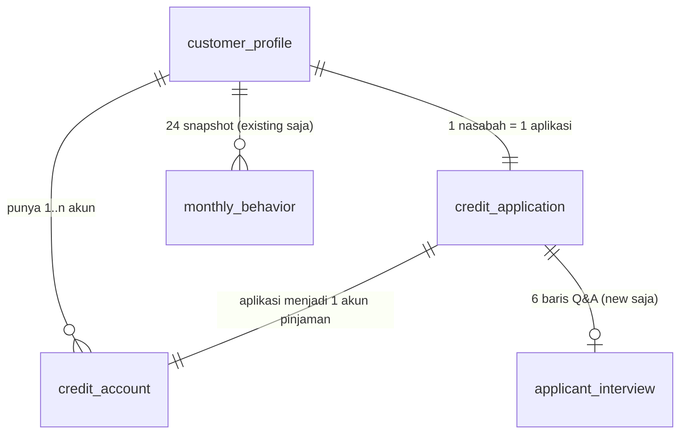

# ICA Dataset v4: Metadata & Panduan Data

> Dokumen ini menjelaskan **isi data, asal-usul tiap kolom, cara label dibuat, dan aturan pakainya**.
> Target pembaca: engineer atau data scientist yang baru pertama kali pegang dataset ICA (Intelligent Credit Analyst).

---

## 1. Ringkasan

| | |
|---|---|
| **Domain** | Kredit konsumer & UMKM retail (perbankan Indonesia) |
| **Sifat data** | Sintetis (dibuat generator, seed 42). Tidak ada data nasabah asli dan tidak ada PII |
| **Isi** | 5 tabel CSV, 12.000 nasabah, 12.000 aplikasi kredit, ±22.000 akun, 192.000 snapshot bulanan, 4.000 interview |
| **Periode** | Perilaku bulanan Jan 2024 – Des 2025 · aplikasi Jul – Des 2024 |
| **Dipakai untuk** | 3 model: **Credit Risk new applicant**, **Credit Risk existing customer**, **Early Warning** + GenAI (ekstraksi interview) + Agentic AI (tools investigasi) |
| **Label utama** | `default_12m` (Credit Risk) dan `deterioration_next_1m` (Early Warning) |

**Satu kalimat:** setiap nasabah punya "kondisi finansial tersembunyi". Kondisi itu memengaruhi jawaban interview,
pola bayar bulanan, dan peluang gagal bayar. Karena itu semua tabel saling konsisten, dan model bisa belajar pola yang masuk akal.

---

## 2. Cerita di balik data

Bayangkan sebuah bank. Ada dua jenis orang yang mengajukan kredit:

- **Existing customer** (8.000 orang): sudah punya kartu kredit atau pinjaman di bank sejak sebelum 2024.
  Bank punya catatan perilaku bayar mereka setiap bulan.
- **New applicant** (4.000 orang): belum pernah jadi nasabah. Bank tidak punya histori, jadi analis
  melakukan **interview singkat** (6 pertanyaan) untuk menggali kondisi keuangannya.

Semua orang ini mengajukan kredit di **Jul – Des 2024**. Semua aplikasinya disetujui dan dicairkan. Setelah itu
bank memantau selama **12 bulan**: apakah peminjam sampai menunggak ≥ 90 hari (default)?

```
2015 ─────── 2023 ──┬── Jan 2024 ─────────── Jul–Des 2024 ─────────────── Des 2025
                    │       │                     │                           │
 akun lama nasabah  │  snapshot bulanan mulai     │  APLIKASI + pencairan     │  data berakhir
 existing dibuka    │  (khusus existing)          │  interview (khusus new)   │  (status akhir akun)
                    │                             │                           │
                    │◄── boleh dipakai sebagai ──►│◄── jendela performa 12 bln ──►│
                    │    FITUR Credit Risk        │    (sumber LABEL default_12m)  │
```

---

## 3. Struktur tabel & relasi



| Tabel | Baris | Grain (1 baris = …) | Primary key | Foreign key | Untuk siapa |
|---|---|---|---|---|---|
| `customer_profile` | 12.000 | 1 nasabah | `customer_id` | – | semua |
| `credit_application` | 12.000 | 1 aplikasi kredit | `application_id` | `customer_id` | semua |
| `credit_account` | 21.990 | 1 akun (kartu / pinjaman) | `account_id` | `customer_id`, `application_id` | semua |
| `applicant_interview` | 24.000 | 1 pertanyaan dalam 1 interview | (`interview_id`, `question_id`) | `application_id` | new applicant |
| `monthly_behavior` | 192.000 | 1 nasabah × 1 bulan | (`customer_id`, `snapshot_date`) | `customer_id` | existing customer |

Pola ID: `CUST00001`–`CUST12000` (00001–08000 = existing, 08001–12000 = new), `APPxxxxx` (nomornya sama dengan nomor
customer), `ACCxxxxx`, `INTxxxxx`.

---

## 4. Label: definisi & cara dibuat

| Label | Tabel | Definisi | Rate positif | Kapan NaN |
|---|---|---|---|---|
| `default_12m` | credit_application | **1** jika DPD ≥ 90 hari (kolektibilitas 3–5 OJK) terjadi dalam **12 bulan setelah pencairan** | 9,7% (existing 8,7% · new 11,8%) | tidak pernah |
| `deterioration_next_1m` | monthly_behavior | **1** jika *bucket* DPD bulan depan **lebih buruk** dari bulan ini | 9,3% | bulan terakhir (Des 2025) atau nasabah sudah default (DPD ≥ 90) |
| `default_next_3m` | monthly_behavior | **1** jika DPD ≥ 90 tercapai dalam 3 bulan ke depan (label pendukung, opsional) | 1,3% | 3 bulan terakhir atau sudah default |

**Bucket DPD** yang dipakai label Early Warning:

| Bucket | DPD | Arti |
|---|---|---|
| 0 | 0 | lancar |
| 1 | 1–29 | telat beberapa hari |
| 2 | 30–59 | tunggak 1 cicilan |
| 3 | 60–89 | tunggak 2 cicilan |
| 4 | ≥ 90 | **default** |

Contoh: bulan ini DPD 0, bulan depan DPD 12 → bucket 0 → 1 → `deterioration_next_1m = 1`.

**Konsistensi yang dijamin generator (bisa diverifikasi):**
- Semua `default_12m = 1` punya akun hasil aplikasi berstatus `Default` dengan `days_past_due ≥ 90`. Semua `default_12m = 0` tidak pernah mencapai DPD 90.
- Untuk existing customer, `default_12m` dihitung langsung dari jejak DPD di `monthly_behavior`.
- Default selalu melewati tahapan 30 → 60 → 90 hari. Beberapa bulan sebelumnya utilisasi naik dan payment ratio turun.
  Ini yang membuat Early Warning bisa dideteksi lebih awal.

---

## 5. Kamus kolom

**Kolom "Peran"** menjawab pertanyaan "boleh dipakai buat apa?":
- **ID**: kunci join, bukan fitur
- **Fitur**: boleh jadi input model
- **Label**: target model
- **Outcome**: kejadian *setelah* keputusan. **Jangan** jadi fitur (bocor/leakage); boleh untuk analisis & tools agent
- **Sensitif**: atribut demografis yang **sengaja tidak dipakai** sebagai fitur (fairness), hanya untuk audit
- **Meta**: tanggal/teks pendukung

### 5.1 `customer_profile`: siapa nasabahnya

| Kolom | Tipe | Nilai / rentang | Arti | Peran |
|---|---|---|---|---|
| `customer_id` | string | CUST00001–CUST12000 | ID nasabah | ID |
| `customer_status` | kategori | existing 66,7% · new 33,3% | Status **saat aplikasi**: sudah punya akun sebelumnya atau belum | Fitur / routing |
| `age` | int | 21–60 (median 37) | Umur (tahun) | Fitur |
| `gender` | kategori | Male 52% · Female 48% | Jenis kelamin | **Sensitif** |
| `marital_status` | kategori | Married 66,7% · Single 27,7% · Divorced 5,6% | Status pernikahan | **Sensitif** |
| `dependents` | int | 0–4 (median 1) | Jumlah tanggungan | Fitur |
| `employment_type` | kategori | Salaried 56,2% · Business Owner 17,4% · Self-employed 16,7% · Contract 9,8% | Jenis pekerjaan | Fitur |
| `employment_tenure_months` | int | 3–396 (median 41) | Lama bekerja/berusaha (bulan) | Fitur |
| `monthly_income` | float (Rp) | 3,5 jt – 166 jt (median 10,6 jt) | Penghasilan bulanan | Fitur |
| `income_source` | kategori | Salary 58,1% · Business 27,3% · Mixed 14,5% | Sumber penghasilan | Fitur |
| `customer_since` | tanggal | 2014 – 2025 | Pertama jadi nasabah. Untuk new = tanggal pencairan | Meta (turunan: lama relasi) |
| `city` | kategori | 7 kota (Jakarta 29,2% terbanyak) | Domisili | **Sensitif** |
| `customer_segment` | kategori | Mass 38,7% · Upper Mass 52,9% · Affluent 8,4% | Diturunkan dari penghasilan: < 9 jt / 9–25 jt / ≥ 25 jt | Fitur |

### 5.2 `credit_application`: apa yang diajukan

| Kolom | Tipe | Nilai / rentang | Arti | Peran |
|---|---|---|---|---|
| `application_id` | string | APP00001–APP12000 | ID aplikasi | ID |
| `customer_id` | string | | FK ke profil | ID |
| `customer_status` | kategori | existing / new | Duplikat dari profil, untuk kemudahan | Fitur / routing |
| `application_date` | tanggal | 2024-07-01 – 2024-12-31 | Tanggal pengajuan = **titik waktu prediksi** | Meta (batas point-in-time) |
| `loan_type` | kategori | Personal 44,3% · Auto 21,0% · Business 19,6% · Home 15,2% | Jenis kredit | Fitur |
| `loan_purpose` | kategori | 9 nilai, konsisten dengan loan_type | Tujuan kredit (Auto → Vehicle Purchase, Home → Home Purchase/Renovation, Business → Working Capital/Expansion, Personal → Consumption/Education/Emergency/Renovation/Debt Consolidation) | Fitur |
| `requested_amount` | float (Rp) | 3 jt – 3 M (median 68,2 jt) | Plafon yang dicairkan | Fitur |
| `tenor_months` | int | 12 – 240 (median 36) | Jangka waktu | Fitur |
| `interest_rate` | float (%/thn) | 7 – 18 (median 11,85) | Bunga efektif tahunan | Fitur |
| `monthly_installment` | float (Rp) | 98 rb – 63,5 jt | Cicilan bulanan pinjaman baru (anuitas) | Fitur |
| `existing_monthly_debt` | float (Rp) | 0 – 60 jt (median 1,16 jt) | Total cicilan lain di **semua lembaga** saat aplikasi (setara SLIK OJK) | Fitur |
| `application_channel` | kategori | Branch 44,9% · Online 40,3% · Referral 14,8% | Kanal pengajuan | Fitur |
| `disbursement_date` | tanggal | aplikasi + 3–14 hari | Tanggal pencairan, awal jendela performa | **Outcome** |
| `default_12m` | 0/1 | 9,7% positif | **Label Credit Risk** | **Label** |

> 💡 Fitur paling penting yang **tidak tersedia langsung** adalah **DSR** (Debt Service Ratio):
> `(monthly_installment + existing_monthly_debt) / monthly_income`. Median 0,44. Plafon dibatasi kebijakan DSR 30–70%,
> dengan ±8% pengecualian (DSR maks 1,67).

### 5.3 `credit_account`: akun yang dimiliki (status akhir per 31 Des 2025)

| Kolom | Tipe | Nilai / rentang | Arti | Peran |
|---|---|---|---|---|
| `account_id` | string | ACC00001–ACC21990 | ID akun | ID |
| `customer_id` | string | | FK ke profil | ID |
| `application_id` | string | kosong 45,4% | Terisi = akun hasil aplikasi di tabel aplikasi. Kosong = akun lama nasabah existing | ID |
| `product_type` | kategori | Credit Card 33,7% · Personal 30,1% · Auto 15,3% · Business 12,7% · Home 8,3% | Jenis produk | Fitur* |
| `open_date` | tanggal | 2016 – 2025 | Tanggal buka | Fitur* (lama relasi, jumlah akun) |
| `close_date` | tanggal | kosong 83,8% | Tanggal lunas/jatuh tempo. Kosong = masih aktif | Fitur* |
| `credit_limit` | float (Rp) | 3 jt – 3 M | Limit kartu atau pokok awal pinjaman | Fitur* |
| `outstanding` | float (Rp) | 0 – 2,9 M | Baki debet per 31 Des 2025 | **Outcome** |
| `interest_rate` | float (%) | 7 – 30 (kartu kredit 18–30) | Bunga akun | Fitur* |
| `tenor_months` | int | 0 – 240 | **0 = revolving (kartu kredit)** | Fitur* |
| `monthly_installment` | float (Rp) | | Cicilan / minimum payment | Fitur* |
| `account_status` | kategori | Active 71,4% · Closed 16,2% · Default 9,2% · Delinquent 3,3% | Active (DPD < 30), Delinquent (30–89), Default (≥ 90), Closed (lunas) | **Outcome** |
| `days_past_due` | int | 0 – 545 | DPD per 31 Des 2025 | **Outcome** |

\* Boleh dipakai sebagai fitur **hanya** untuk akun dengan `open_date < application_date`, dan statusnya dihitung
per tanggal aplikasi (contoh: jumlah akun aktif saat aplikasi). Tabel ini terutama untuk **tools Agentic AI**
(credit history & credit exposure).

### 5.4 `applicant_interview`: interview new applicant

Format *long*: 6 baris per interview (Q01–Q06). Label ekstraksi bernilai **sama di semua baris interview yang sama**.

| Kolom | Tipe | Nilai | Arti | Peran |
|---|---|---|---|---|
| `interview_id` | string | INT00001–INT04000 | ID interview | ID |
| `application_id` | string | APP08001–APP12000 | FK ke aplikasi new | ID |
| `question_id` | kategori | Q01–Q06 | Nomor pertanyaan | Meta |
| `question` | teks | 6 pertanyaan tetap | Teks pertanyaan | Meta |
| `response_text` | teks | ±7.800 kalimat unik | Jawaban bebas (Bahasa Indonesia, ada gaya informal, nominal Rupiah, dll.) | **Input GenAI** |
| `interview_date` | tanggal | 0–7 hari sebelum aplikasi | Tanggal interview | Meta |
| `income_trend` | kategori | stable 54,9% · increasing 19,4% · declining 15,7% · volatile 10,0% | Dari Q01 | Fitur / ground truth GenAI |
| `income_stability` | kategori | high 50% · medium 40% · low 10% | Dari Q01 | Fitur / ground truth GenAI |
| `existing_debt_level` | kategori | none 23,6% · low 29,7% · medium 28,6% · high 18,1% | Dari Q02. Pengakuan sendiri (self-report), ±12% menyebut level lebih rendah dari kenyataan | Fitur / ground truth GenAI |
| `repayment_issue` | kategori | none 60% · occasional 30% · frequent 10% | Dari Q03. Riwayat bayar di lembaga lain | Fitur / ground truth GenAI |
| `financial_change` | kategori | stable 50% · expense_increase 19,6% · income_decrease 18,8% · business_decline 11,7% | Dari Q04. `business_decline` hanya untuk yang punya usaha | Fitur / ground truth GenAI |
| `business_condition` | kategori | not_applicable 57,9% · stable 16,9% · growing 14,8% · declining 10,5% | Dari Q06. `not_applicable` untuk karyawan | Fitur / ground truth GenAI |

Pemetaan pertanyaan → label:

| Q | Pertanyaan | Label yang diekstrak |
|---|---|---|
| Q01 | Bagaimana kondisi pendapatan Anda dalam beberapa bulan terakhir? | `income_trend`, `income_stability` |
| Q02 | Apakah saat ini Anda memiliki cicilan atau kewajiban kredit lain? | `existing_debt_level` |
| Q03 | Bagaimana riwayat pembayaran cicilan Anda sebelumnya? | `repayment_issue` |
| Q04 | Apakah ada perubahan kondisi keuangan akhir-akhir ini? | `financial_change` |
| Q05 | Apa tujuan utama pengajuan kredit? | (cocok dengan `loan_purpose` di aplikasi) |
| Q06 | Bagaimana kondisi usaha atau pekerjaan Anda saat ini? | `business_condition` |

Contoh satu interview:
```
[Q01] > Begini, jujur lagi turun, sekarang cuma Rp8.900.000 sebulan. Saya udah 3 tahun di kantor ini.
[Q02] > Cuma kartu kredit, sebulan 1 juta.
[Q03] > Sesekali telat sedikit, tapi selalu saya lunasi.
[Q04] > Pengeluaran naik, baru punya anak.
[Q05] > Ya, beli kendaraan untuk operasional kerja.
[Q06] > Jujur ya, pekerjaan saya stabil, kantor juga sehat.
→ income_trend=declining · repayment_issue=occasional · financial_change=expense_increase · ...
```

### 5.5 `monthly_behavior`: perilaku bulanan existing customer

Snapshot akhir bulan, 24 bulan × 8.000 nasabah. Semua nilai = kondisi **pada bulan itu** (tidak melihat masa depan),
kecuali dua label di akhir.

| Kolom | Tipe | Nilai / rentang | Arti | Peran |
|---|---|---|---|---|
| `customer_id` | string | | FK ke profil | ID |
| `snapshot_date` | tanggal | 2024-01-31 – 2025-12-31 (akhir bulan) | Bulan snapshot | Meta |
| `total_outstanding` | float (Rp) | median 42,6 jt | Total baki debet semua akun aktif di bank | Fitur |
| `total_credit_limit` | float (Rp) | median 81,9 jt | Total limit/pokok akun aktif | Fitur |
| `credit_utilization` | float | 0 – 1 (median 0,57) | outstanding / limit | Fitur |
| `total_amount_due` | float (Rp) | median 2,5 jt | Total tagihan jatuh tempo bulan itu | Fitur |
| `total_monthly_payment` | float (Rp) | median 2,1 jt | Nominal yang **dibayar** bulan itu | Fitur |
| `payment_ratio` | float | 0 – 3 (median 0,98) | dibayar / tagihan. < 1 = kurang bayar · > 1 = melunasi tunggakan | Fitur |
| `dpd` | int | 0 – 545 (75% bernilai 0) | Days past due saat snapshot | Fitur |
| `late_payment_count` | int | 0 – 6 | Jumlah bayar telat (DPD 1–29) dalam 6 bulan terakhir | Fitur |
| `missed_payment_count` | int | 0 – 6 | Jumlah cicilan tidak dibayar dalam 6 bulan terakhir | Fitur |
| `overdue_amount` | float (Rp) | 0 – 898 jt | Nominal tunggakan | Fitur |
| `active_accounts` | int | 0 – 4 | Jumlah akun aktif di bank | Fitur |
| `new_credit_accounts` | 0/1 | | Buka kredit baru di **lembaga lain** bulan itu (sinyal SLIK, *credit hungry*) | Fitur |
| `outstanding_change_1m` | float | −1 – 8.036 | Perubahan outstanding vs bulan lalu (rasio) | Fitur ⚠️ lihat §8 |
| `payment_ratio_change_1m` | float | −2,96 – 2,96 | Perubahan payment ratio vs bulan lalu | Fitur |
| `max_dpd_3m` | int | 0 – 545 | DPD maksimum 3 bulan terakhir | Fitur |
| `avg_utilization_3m` | float | 0 – 1 | Rata-rata utilisasi 3 bulan terakhir | Fitur |
| `deterioration_next_1m` | 0/1/NaN | 9,3% positif | **Label Early Warning** | **Label** |
| `default_next_3m` | 0/1/NaN | 1,3% positif | Label pendukung | Label / Outcome |

---

## 6. Aturan pakai data (anti-leakage)

Aturan ini dicek otomatis oleh guardrail di notebook. Kalau dilanggar, notebook berhenti.

| ✅ Boleh | ❌ Jangan |
|---|---|
| Fitur perilaku Credit Risk existing dari snapshot `snapshot_date < application_date` | Pakai snapshot setelah tanggal aplikasi (itu masa depan) |
| Fitur akun yang sudah dibuka sebelum aplikasi (jumlah akun, limit, kartu) | Pakai `account_status`, `days_past_due`, `outstanding` dari `credit_account` (status akhir 2025 = hasil) |
| Fitur EW yang hanya memakai data sampai bulan t (lag, delta, rolling) | Pakai `default_next_3m` sebagai fitur EW |
| Split EW **per nasabah** (GroupShuffleSplit) | Split EW acak per baris (nasabah yang sama ada di train dan test) |
| Audit hasil model per gender/kota | Pakai `gender`, `city`, `marital_status` sebagai fitur |
| Hitung feature selection (IV, korelasi) hanya di train | Hitung statistik seleksi di seluruh data |

Contoh point-in-time join yang benar:
```python
key = apps[["application_id", "customer_id", "application_date"]]
m = monthly.merge(key, on="customer_id")
m = m[m.snapshot_date < m.application_date]           # hanya masa lalu
last6 = m.sort_values("snapshot_date").groupby("application_id").tail(6)
```

---

## 7. Pola penting di data (sudah divalidasi)

**Credit Risk** (`default_12m`):

| Pendorong | Risiko rendah | Risiko tinggi |
|---|---|---|
| DSR | 10% terendah (< 0,25): **1,8%** | 10% tertinggi (> 0,65): **31,8%** |
| Jenis pekerjaan | Salaried 7,4% · Business Owner 6,2% | **Contract 24,9%** |
| Masa kerja | ≥ 12 bulan: 9,1% | < 12 bulan: **16,8%** |
| Segmen | Affluent 3,9% | Mass 14,2% |
| Interview: stabilitas penghasilan | high 5,1% | **low 36,5%** |
| Interview: riwayat bayar | none 6,9% | **frequent 30,5%** |
| Interview: tren penghasilan | increasing 3,4% | declining 23,9% · volatile 20,0% |

**Tidak berpengaruh** (sengaja, demi fairness): gender (Female 10,0% vs Male 9,5%), kota, status pernikahan.

**Early Warning** (`deterioration_next_1m`):
- Rata-rata nasabah yang akan memburuk: utilisasi 0,64 (vs 0,53), payment ratio 0,90 (vs 0,95), lebih sering buka kredit di tempat lain.
- Dari 8.000 nasabah existing, 699 pernah default. Sinyalnya mulai terlihat **6–8 bulan sebelum** DPD ≥ 90: utilisasi naik bertahap, lalu payment ratio jatuh tajam 2–3 bulan sebelumnya.
- Kalau seseorang mengalami deteriorasi, peluang default dalam 3 bulan = **12,6%**. Kalau tidak = 0,1%.

**Baseline sanity check** (model GBM default, tanpa feature engineering, AUC):
CR new ≈ 0,75 → 0,80 dengan interview · CR existing ≈ 0,76 → 0,79 dengan perilaku · EW ≈ 0,77.
Masih ada ruang naik lewat feature engineering.

---

## 8. Hal yang perlu diketahui (quirks & simplifikasi)

| # | Hal | Dampak / cara tangani |
|---|---|---|
| 1 | **Data sintetis** | Pola sengaja dibuat realistis, tapi hasil model perlu divalidasi ulang di data riil |
| 2 | **Hanya aplikasi yang disetujui** (tidak ada aplikasi ditolak) | Tidak ada *reject inference*. Model tidak pernah melihat profil yang ditolak bank |
| 3 | DPD dihitung **per nasabah** | Semua akun aktif seorang nasabah punya DPD yang sama |
| 4 | New applicant **tidak punya** `monthly_behavior` setelah pencairan | Hasil akhirnya hanya terlihat di `credit_account` |
| 5 | `outstanding_change_1m` bisa sangat besar (maks 8.036) | Terjadi saat outstanding naik dari hampir 0 (pinjaman baru cair). Clip atau pakai log untuk model linear |
| 6 | `payment_ratio` bisa > 1 (maks 3) | Artinya melunasi tunggakan bulan sebelumnya, bukan error |
| 7 | `existing_debt_level` (interview) bisa berbeda dari `existing_monthly_debt` (aplikasi) | Disengaja: ±12% responden *understate*. Bahan cross-check untuk Agentic AI |
| 8 | Label EW kosong (NaN) 6,9% | Bulan terakhir (8.000 baris) + nasabah yang sudah default (5.982 baris). Buang saat training EW |
| 9 | Distribusi label interview sebagian dibuat rata (50/20/20/10 dsb.) | Supaya tiap kategori punya sampel cukup untuk training & evaluasi GenAI |
| 10 | Plafon per `loan_type` realistis tapi disederhanakan | Home Loan median 322 jt, Auto 108 jt, Business 74 jt, Personal 38 jt |

---

## 9. Glosarium

| Istilah | Arti |
|---|---|
| **DPD** (Days Past Due) | Berapa hari cicilan terlambat dibayar |
| **Kolektibilitas OJK** | Klasifikasi kualitas kredit: 1 Lancar (0 DPD) · 2 Dalam Perhatian Khusus (1–90) · 3 Kurang Lancar (91–120) · 4 Diragukan (121–180) · 5 Macet (> 180). Definisi default di dataset ini (DPD ≥ 90) ≈ kol 3–5 |
| **Default** | Gagal bayar, di sini DPD ≥ 90 |
| **NPL** (Non-Performing Loan) | Porsi kredit yang default |
| **DSR** (Debt Service Ratio) | Total cicilan / penghasilan. Makin tinggi, makin berat beban bayar |
| **LTI** (Loan-to-Income) | Plafon / penghasilan setahun |
| **Utilisasi** | Seberapa penuh limit kredit dipakai |
| **Payment ratio** | Berapa persen tagihan yang dibayar |
| **SLIK OJK** | Sistem informasi debitur nasional, catatan kredit seseorang di semua lembaga |
| **PD** (Probability of Default) | Output model Credit Risk: peluang gagal bayar |
| **LGD** (Loss Given Default) | Porsi kerugian jika default (asumsi dashboard 45%) |
| **IV** (Information Value) | Ukuran kekuatan prediktif satu variabel (< 0,02 tidak berguna · > 0,3 kuat) |
| **PSI** (Population Stability Index) | Ukuran pergeseran distribusi data baru vs data training (< 0,1 stabil) |
| **Point-in-time** | Fitur hanya boleh memakai informasi yang sudah ada pada saat prediksi dibuat |

---

## 10. Quick start

```python
import pandas as pd
D = "ICA_Synthetic_v4/"
cp = pd.read_csv(D + "customer_profile.csv", parse_dates=["customer_since"])
ap = pd.read_csv(D + "credit_application.csv", parse_dates=["application_date", "disbursement_date"])
ac = pd.read_csv(D + "credit_account.csv", parse_dates=["open_date", "close_date"])
iv = pd.read_csv(D + "applicant_interview.csv", parse_dates=["interview_date"])
mb = pd.read_csv(D + "monthly_behavior.csv", parse_dates=["snapshot_date"])

# tabel Credit Risk: aplikasi + profil (+ DSR)
cr = ap.merge(cp.drop(columns="customer_status"), on="customer_id")
cr["dsr"] = (cr.monthly_installment + cr.existing_monthly_debt) / cr.monthly_income

# interview → 1 baris per aplikasi
labels = ["income_trend", "income_stability", "existing_debt_level", "repayment_issue",
          "financial_change", "business_condition"]
iv_wide = iv.groupby("application_id")[labels].first().reset_index()

# tabel Early Warning: buang baris tanpa label
ew = mb.dropna(subset=["deterioration_next_1m"])
```

File pendukung di folder dataset: `README.md` (ringkas), `distribution_summary.json` (distribusi otomatis),
`generate_ica_data.py` (generator, seed 42, bisa dijalankan ulang untuk membuat data identik).
